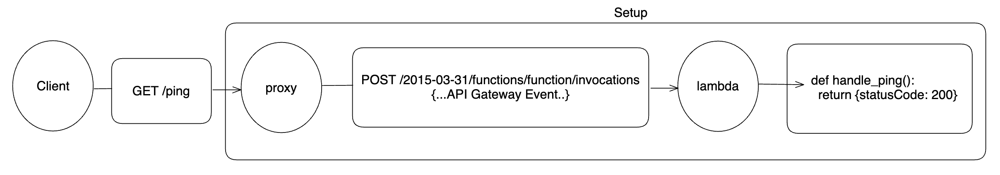

# AWS Local Serverless Proxy
HTTP API gateway for locally testing AWS lambdas

### Setup
* Download from [releases assets](https://github.com/atorrescogollo/aws-lambda-serverless-proxy/releases):
```bash
curl -Lo aws-lambda-serverless-proxy \
    "https://github.com/atorrescogollo/aws-lambda-serverless-proxy/releases/download/<VERSION>/aws-lambda-serverless-proxy_<OS>_<ARCH>"
chmod +x aws-lambda-serverless-proxy

AWS_LAMBDA_RUNTIME_API=localhost:9000 ./aws-lambda-serverless-proxy
```

* With docker:
```bash
docker pull ghrc.io/atorrescogollo/aws-lambda-serverless-proxy:<VERSION>

docker run \
    -p 8080:8080 \
    -e AWS_LAMBDA_RUNTIME_API=lambda:8080 \
    ghrc.io/atorrescogollo/aws-lambda-serverless-proxy:<VERSION>
```

* With docker-compose:
```yaml
version: '3.7'

services:
  proxy:
    image: ghrc.io/atorrescogollo/aws-lambda-serverless-proxy:<VERSION>
    ports:
      - 8080:8080
    environment:
      - AWS_LAMBDA_RUNTIME_API=lambda:8080
    depends_on:
      - lambda
    tty: true

  lambda: # The lambda service you want to test
    build:
      context: .
      target: lambda
    ports:
      - 9000:8080
    tty: true
```
```bash
docker-compose up -d
```

# Usage
Now you can reach your lambda as if it was deployed in AWS with an API Gateway:



```bash
curl localhost:8080/ping
```
